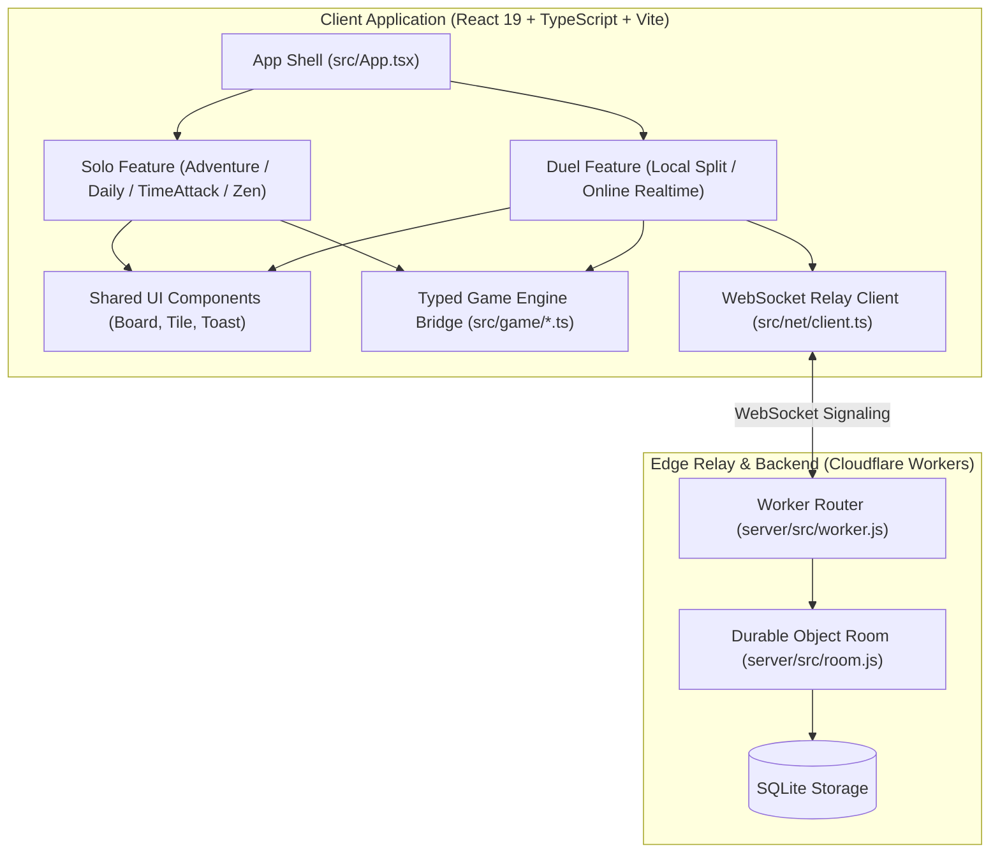

# 🏗️ Pikachu Duel Architecture & Engineering Guide

This document outlines the architecture, data models, game engine mechanics, and networking layer of **Pikachu Duel**.

---

## 1. System Overview

---

## 2. Core Game Engine (`src/game/`)

The core engine is framework-agnostic, deterministic, and runnable natively in both Node.js (via Node 24 native TypeScript type stripping) and modern browsers.

### 2.1 Deterministic Pseudo-Random Generation (`rng.ts`)
- Utilizes the **Mulberry32** algorithm (`MULBERRY32_DEFAULT_SEED = 0x9e3779b9`, `MULBERRY32_INCREMENT = 0x6d2b79f5`).
- Guarantees byte-identical board deals across both players in online duels and all global players in the Daily Challenge.
- Seed derivation via `deriveSeed` ensures reshuffles and mark scattering maintain reproducibility without state pollution.

### 2.2 Memory Layout & Padded 1D Indexing (`grid.ts`)
- Boards are stored in flat TypedArrays (`cells: Int32Array`), padded with a 1-cell border ring:
  $$\text{stride} = \text{cols} + 2$$
  $$\text{totalBufferSize} = \text{stride} \times (\text{rows} + 2)$$
- Coordinate translation:
  $$\text{index}(r, c) = r \times \text{stride} + c$$
- **Border Wrap-Around**: The 1-cell empty ring around the playable area ($r \in [1, \text{rows}]$, $c \in [1, \text{cols}]$) allows pathfinding to legally exit the grid boundary and wrap around perimeter tiles, preserving classic Pikachu/Onet mechanics.

### 2.3 Pathfinding & Connection Rules (`connect.ts`)
- Two matching tiles ($A$ and $B$) can be connected and cleared if and only if an orthogonal line path exists through empty cells (`EMPTY = 0`) with **at most two 90-degree turns** (`MAX_TURNS = 2`):
  1. **Zero turns**: Direct axis-aligned line ($A$ and $B$ share row or column with unobstructed path).
  2. **One turn**: Path through either bounding-box corner ($(A.r, B.c)$ or $(B.r, A.c)$).
  3. **Two turns**: Path stepping out through an empty column or row lane (including border padding) and returning.
- **Dead-Board Detection & Auto-Reshuffle**: `findAnyMove` performs an exhaustive scan across remaining tile groups. If no legal move exists, `reshuffle` deterministically rearranges the board.

### 2.4 Gravity Compaction (`gravity.ts`)
- Supports 8 directional and symmetric gravity compaction modes:
  - Linear: `'down'`, `'up'`, `'left'`, `'right'`
  - Symmetric Horizontal: `'inward-h'` (collapse to center), `'outward-h'` (split outward)
  - Symmetric Vertical: `'inward-v'`, `'outward-v'`
- Compaction operates in-place per lane, returning precise `{ from, to }` vector translations so the UI can animate tile slides smoothly.

### 2.5 Special Marks & Hazards (`marks.ts`)
- Marks and fuses sit in dedicated flat `Int32Array` buffers aligned with `board.cells`:
  - **Gold (`MARK_GOLD = 1`)**: Multiplies match score by $3\times$.
  - **Ice (`MARK_ICE = 2`)**: Requires two matches; the first match cracks the ice without removing the tiles.
  - **Bomb (`MARK_BOMB = 3`)**: Decrements fuse per move; detonations subtract clock time (`BOMB_PENALTY_SECONDS = 15`).
  - **Chrono (`MARK_CHRONO = 4`)**: Awards bonus time (`CHRONO_SURGE_SECONDS = 8`) and freezes the countdown timer (`CHRONO_FREEZE_SECONDS = 5`).

### 2.6 Adventure Ladder Progression (`stages.ts`)
- Pure, deterministic calculation of stage parameters based on stage index $N$:
  - Dimensions scale across 8 standard board configurations from $6 \times 8$ up to $12 \times 16$.
  - Allotted time per pair tightens smoothly from $3.6\text{s}$ down to $1.9\text{s}$ (capped at 180s per stage).
  - Sequential introduction of mechanics:
    - Stage 3: Gold tiles
    - Stage 4: Gravity dynamics
    - Stage 5: Chrono tiles
    - Stage 6: Ice tiles
    - Stage 9: Bomb hazards

---

## 3. Frontend Architecture (`src/`)

### 3.1 Feature-Driven Structure
The codebase follows a modular feature-sliced architecture:
- `src/features/solo/`: Single-player modes, Adventure ladder, Time Attack, Daily puzzle, Run HUD, and stage completion overlays.
- `src/features/duel/`: Two-player local split-screen cabinet, online multiplayer lobby, and synchronized race logic.
- `src/features/leaderboard/`: Cloudflare account sync, modal views, and global ranking tables.
- `src/features/admin/`: Developer & QA Stage Controller, debug tools, and floating in-game stage jumper.
- `src/shared/`: Common primitives (`Board`, `Tile`, `Toast`), audio synthesizers, and shared domain models.

### 3.2 Routing & Navigation (React Router v7)
- Client-side SPA routing powered by `react-router-dom`:
  - `/`: Primary single-player mode surface.
  - `/duel`: Real-time multiplayer split-screen and online lobby.
  - `/admin`: Interactive Admin Console for setting/inspecting stage configurations, unlocking stages, and test submissions.
  - `/admin/:stage`: Direct permalink to stage inspector for any stage (e.g. `/admin/16`).
  - `?stage=X`: Directly starts Adventure mode at stage $X$.
  - `?admin=true`: Enables the in-game floating stage jumper anywhere.

### 3.3 Performance & Bundle Splitting
- **Dynamic Code Splitting**: Heavy online duel components (`DuelGame`) are loaded asynchronously via `React.lazy()` with suspense boundaries, trimming initial bundle payload size by $\sim 35\text{ kB}$.
- **Immutable & Mutable State Boundaries**: While `board.cells` is mutated in-place by the high-performance core engine for speed, container components use clone triggers (`new Int32Array(cells)`) to reliably notify React render cycles without race conditions.

### 3.4 Responsive & Mobile Design
- Automatic aspect ratio detection swaps grid rows and columns when running in portrait orientation (e.g., $9 \times 16$ becomes $16 \times 9$), maximizing tile size and touch ergonomics on mobile devices.
- Dynamic CSS viewport clamping prevents vertical board overflow, keeping HUD indicators and controls accessible without document scrolling.

---

## 4. Networking & Multiplayer Relay (`server/`, `src/net/`)

### 4.1 Cloudflare Durable Objects
- Each online room is managed by a lightweight SQLite-backed Durable Object instance (`server/src/room.js`).
- Hibernation support allows zero-cost idle rooms when waiting for opponents.
- The relay server functions as the authoritative source of truth for:
  - Deterministic seed generation.
  - Turn and progress broadcasting.
  - Winner declaration and timeout judging.

### 4.2 Account Progress CRDT Merge (`src/shared/game/progress.ts`)
- Client statistics (stars, unlocks, high scores, streaks) synchronize across offline sessions and cloud accounts using a monotonic conflict-free merge strategy:
  - Monotonic max for numeric scores and stage milestones.
  - Set union for unlocked achievements.
  - Date-based monotonicity for daily challenges.

---

## 5. Quality Assurance & Verification

- **Node 24 Core Test Suite**: 170 test cases executing via `node --experimental-strip-types --test "tests/**/*.test.js"`.
- **UI & Router Test Suite**: 107 Vitest test cases executing component, hook, and routing workflows (`src/**/*.test.tsx`).
- **Total Tests**: 277 automated tests executing in under 5 seconds.
- **Strict TypeScript**: Full type coverage with `noEmit: true` and zero compiler errors (`npm run typecheck`).
- **Linting**: Comprehensive ESLint enforcement with zero warnings (`npm run lint`).
